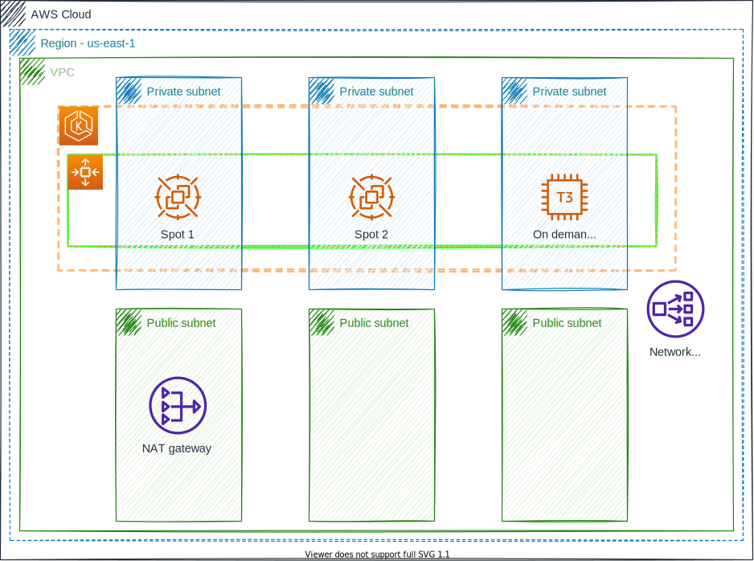

# Challenger
The challenger is create cluster Kubernetes deployment with this example application of the Juro Baixo, used prometheus and grafana and show some statistics

## Architecture

The infrastructure contains cluster Kubernetes(EKS) with one instance on demand and two instances spot, too NAT Gateway just one public subnet and created Network load balance for access cluster Kubernetes

**Used:**
- Terraform v0.14.4



## Kubernetes

For installed grafana, prometheus, jb-fizzbuzz and nginx-ingress(NLB) i used helmfile. Helmfile is a declarative spec for deploying helm charts

**Used:**
- Helm v3.6.3
- Helmfile v0.140.1


## Getting started

The requirements are:
- docker

1 - For create cluster
```
make apply
```

2- Get URL and password for login grafana:

```
make grafana
```

3 - For destroy cluster
```
make destroy
```